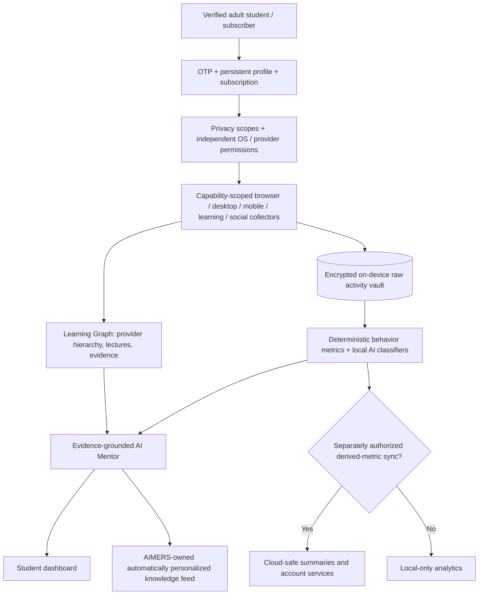
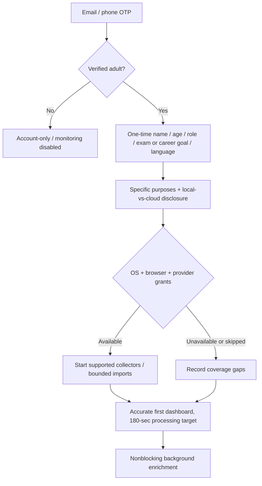
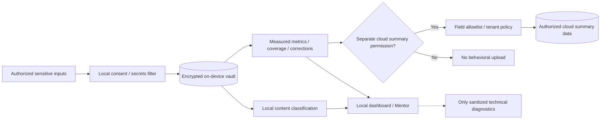
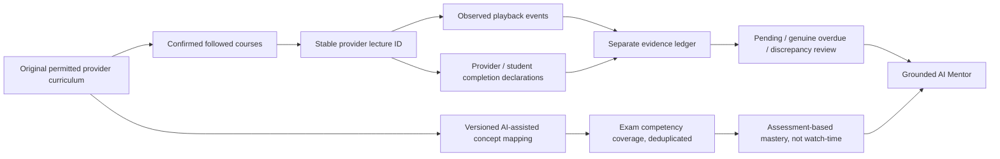
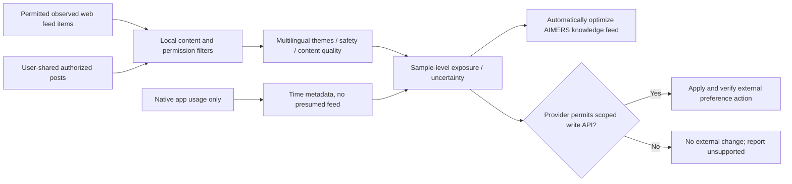
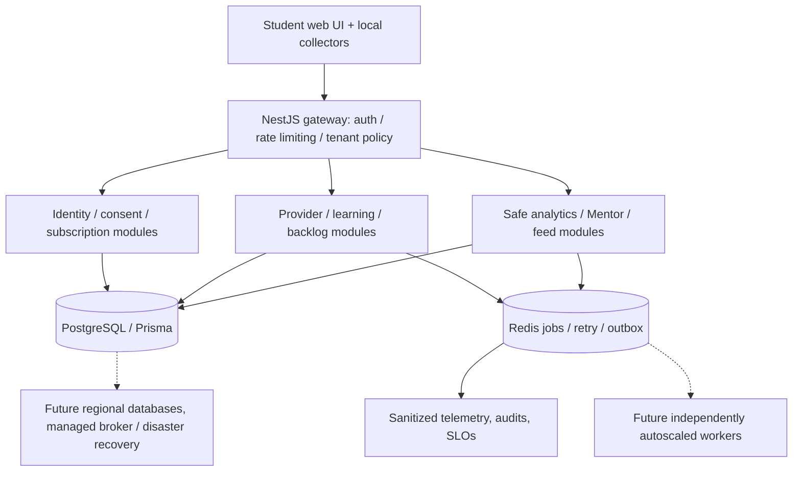
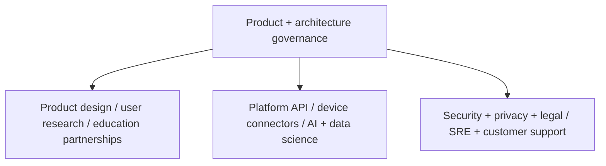

# AIMERS OS — Complete Organization & Dataflow Blueprint

**Design document for review | 2026-10-09.** This is an organizational and systems map, **not a deployed implementation**. The companion downloadable print blueprint has ten A3 landscape pages and seven independently editable flowcharts.

## Outcome and boundary

A subscription-based personal learning and digital-behavior intelligence operating system, first piloted for verified adults. Student profile and OTP authentication; source-specific device/browser permissions; original learning-provider graph; evidence-based academic progress; local-first sensitive activity analysis; social-feed exposure intelligence; evidence-grounded AI Mentor; AIMERS-owned adaptive educational feed. **No personal data sale.** Highly sensitive raw searches, browsing/page content, private media and student mood records stay encrypted on-device by default. Derived cross-device synchronization is separately authorized and not yet a finalized launch setting.

The three-minute goal concerns a first useful **accurate, partial** dashboard, not universal access to historic native social-platform feeds or guaranteed full import. External feed optimization is automatic only if a provider explicitly supports the necessary authorized write operation. AIMERS-owned feed ranking is under our control.

## 1. Organizational system map

## 2. First-login flow / three-minute first report

## 3. Privacy, consent and dataflow

## 4. Learning Graph semantics

## 5. Social Feed & Growth Engine

## 6. Scale architecture

**Start with current pnpm/Turborepo, Vite/React, NestJS and Prisma/PostgreSQL.** Build modules with explicit domain APIs and event versioning before extraction. Move AI workloads and connectors into workers as measured throughput demands, then use managed message streaming, regional isolation and specialized data infrastructure when justified. Existing PW browser integration is an opt-in pilot; the developer's uncommitted local hostname patch and unverified server synchronization must be preserved, not overwritten.

## 7. Proposed organization

Functional responsibilities:
- **Product + design:** OTP, personal profile, adaptive onboarding, feedback, accessibility, subscription value.
- **Platform / core:** account auth, billing, consent, versioned APIs, data lifecycle, tenant isolation.
- **Connectors:** browser, desktop, OS-permitted mobile, external provider metadata.
- **AI/data:** local classification, exact metrics, calibration, Mentor policies and model evaluation.
- **Education intelligence:** original curricula, exam concept mapping, lecture evidence and academic outcomes.
- **Trust, reliability, support:** legal/provider rights, permission boundaries, incident response, deletion, audits and user correction.

## 8. Hard release gates

- Adult monitoring eligibility and source-specific permission are checked at ingestion and processing. Accepting a generic privacy policy is insufficient for new sources.
- No raw sensitive browsing or social-feed content egress by default; no credentials, payments, private messages or covert recording.
- Measured, inferred/classified, self-reported and predicted results remain clearly different. Missing provider coverage ≠ zero observed exposure; social app usage ≠ actual native feed inspection.
- No mind toxicity diagnosis from feed labels; no invented exam score or completed lecture; provider/self-report conflicts are preserved.
- Revoke/pause/delete propagate to collectors, active processing and derived stores; encrypted local storage and retention handling are implemented and tested.
- External social feed actions require confirmed provider-supported access and verified success. AIMERS-owned knowledge feed may re-rank automatically within the student's selected goals.
- Security model, local compute compatibility, supported social website and any sync payload design are reviewed separately before production.
- The architecture is approved in writing **before** a detailed implementation plan; implementation requires plan review and execution authorization.

## Related specifications

- `2026-10-09-aimers-learning-graph-connector-design.md`
- `2026-10-09-aimers-behavior-intelligence-continuous-ai-design.md`
- `2026-10-09-aimers-social-feed-exposure-intelligence-design.md`
- `2026-10-09-aimers-three-minute-onboarding-adaptive-intelligence-design.md`

**Status:** Reviewable technical/organizational design only. No product source or schema was modified for this blueprint.
