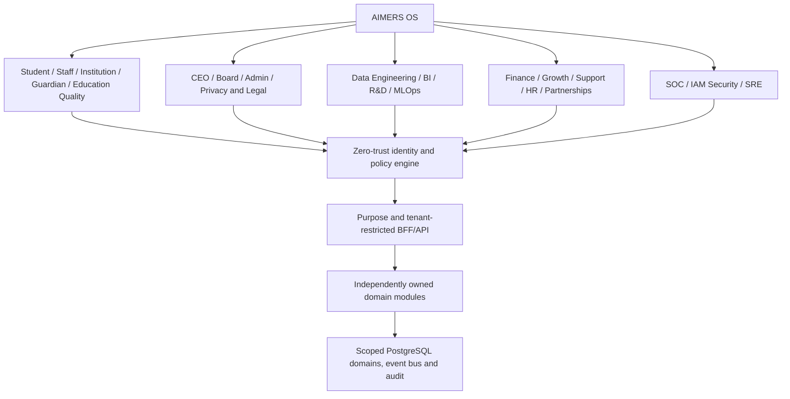
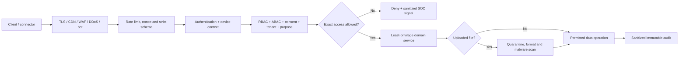
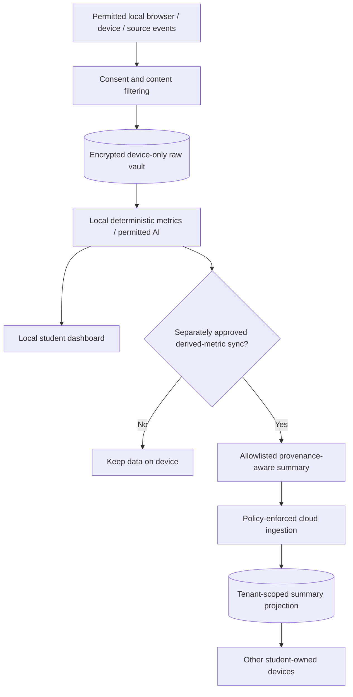
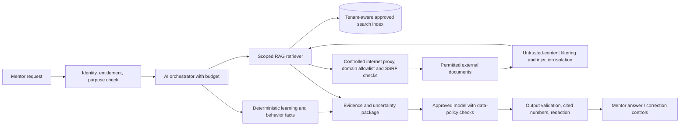

# AIMERS OS — Enterprise Zero-Trust Architecture (Mermaid master blueprint)

**Design-only; requires user review before engineering plan.** This enterprise-wide extension covers student, staff, institution, CEO, board, finance, growth, data engineering, analytics, R&D, MLOps, security operations, IAM, privacy, DevOps, support and HR roles. Companion conversation artifacts contain the complete set of **20 individually editable Mermaid charts** and a portal ownership matrix.

**Product boundaries:** subscription-funded; verified adults first for sensitive behavior monitoring; per-source permission and platform rules; no sale of student data; raw search/feed/mood data **local-encrypted by default**. Derived behavioral cross-device sync remains an opt-in option requiring product approval, not an implicit existing capability. Never diagnose “mind toxicity” from content labels or claim a provider feed was changed without authorized supported write access. The three-minute onboarding target is for a *truthful first useful report*, not exhaustive external account imports.

## Organization / identity boundary

## Incoming traffic scanning and zero-trust access

## Private data and device independence

## AI / internet connection controls

## Operations and scaling

Use separate logical domains and per-schema least-privileged access in PostgreSQL first, alongside a controlled event/outbox pipeline. Extract worker services and independent stores only when throughput/residency/availability requirements justify them. Add signed software supply chain, vulnerability scanning, secret management, access reviews, SOC alerting, incident response, disaster-recovery testing and security chaos exercises. **There is no such thing as guaranteed unhackable software**; Zero Trust is a set of continuous controls, tests and recovery practices.

### Portal ownership guardrails

Student: personal data. Mentor: consented assigned educational data. Institution: tenant-scoped learning and contracts. CEO and board: aggregate approved KPIs. Finance: billing ledger. Marketing: campaign aggregate metrics. Data Engineering/BI: pipeline metadata and approved de-identified marts. R&D: consented/licensed/synthetic evaluated datasets. SOC: infrastructure security metadata and approved investigative workflows. IAM: grant administration, no raw data free pass. SRE: production health, no standing user-data decryption keys. Privacy: consent, deletion and data-rights workflows. Guardian/under-18 experiences require their own privacy/legal gate. No portal role implies raw private browsing access.

### Review gate

This master overview is accompanied by the separately generated full Mermaid pack, containing 20 charts, three logical database ER models, 21 portal-to-service ownership mappings, onboarding, API traffic scanning, ingestion, finance, security, data lifecycle, cross-device and scaling. The written architecture must be reviewed before detailed implementation planning; no production code changes were made.
