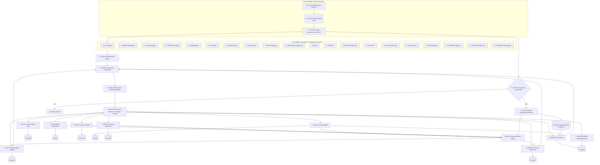

# AIMERS OS — One Connected Master Architecture

**Status:** Architectural design for user review; not implemented.  
**Date:** 2026-10-09  
**Branch:** `docs/unified-connected-master-architecture-20261009`  
**Companions:** Prior enterprise zero-trust, three-minute onboarding, Learning Graph, Behavior Intelligence, Social Feed and adaptive knowledge-feed specifications. A separate generated package provides 14 editable Mermaid zoom-in diagrams, a stable 48-component registry, a 20-contract ledger and an integrated Markdown specification.

## Intent and selected structure

AIMERS is **one integrated multi-tenant product/company**, not independent applications. Each portal has a separate user experience and least-privilege role; all access shared, policy-enforced platform service APIs and immutable auditable business events. Domain owners control persistence. Company leadership, security, marketing and research do not automatically see a student's personal browsing, private social feeds, or mood records.

**Selected technical direction:** modular-first NestJS / Prisma/PostgreSQL infrastructure with strict domain contracts, outbox and async workers. Scale or extract workers/services only when justified by volume, latency, regulation and blast radius. This is more feasible than treating every module as a separately deployed microservice at the start. A student-owned encrypted on-device vault provides sensitive data isolation; cross-device **derived** sync is conditional on independent approval, not a blanket promise.

## Stable identifier scheme

`P_*` = independent portal; `S_*` = authorized service; `D_*` = owned storage domain; `X_*` = edge/collector/trust boundary; `E_BUS` = versioned, retryable event system. The same ID must mean the same component in every detailed diagram and data contract.

**Portal family:** `P_ST` student, `P_MENT` staff/mentor, `P_INST` institution, `P_PARENT` parent/guardian, `P_ADMIN` admin, `P_CEO`, `P_BOARD`, `P_FIN`, `P_MKT`, `P_DATA`, `P_BI`, `P_RD`, `P_MLOPS`, `P_SOC`, `P_SEC`, `P_PRIV`, `P_SRE`, `P_SUPPORT`, `P_PEOPLE`, `P_PARTNER`.

**Core service family:** `S_GATE` API / BFF, `S_IAM` identity/OTP, `S_POL` zero-trust authorization, `S_ACCT` profiles/organizations, `S_SUB` billing/entitlements, `S_PRIV` consents/devices/data rights, `S_EDU` curricula/Learning Graph, `S_LOCALAI` private AI, `S_MENTOR` evidence-grounded guidance, `S_KFEED` AIMERS knowledge feed, `S_CORP` business operations, `S_SECOPS` security/audit, `S_GOV` approved BI/R&D, `S_SYNC` optional derived sync.

**Storage family:** `D_LOCAL` device-sensitive raw vault, `D_CORE` identity, `D_POLICY` permissions, `D_BILL` billing, `D_EDU` academic, `D_SUM` authorized sync projections, `D_KNOW` knowledge index, `D_CORP` corporate, `D_MART` governed analytics, `D_AUDIT` security incidents.

## Connected master graph

The `PEOPLE` → ingress arrow denotes a common *routing path*, not a shared permission. Every operation is re-authorized on its actual actor, subject, resource and purpose. No portal reads any database directly. `S_LOCALAI` may locally render results without uploading sensitive details.

## End-to-end end-user and corporate transactions

**T01: Lecture event.** PW or other explicitly permitted `X_COL` observes playback → `S_PRIV/S_POL` validates a student/device/scope → `S_EDU` persists evidence `D_EDU` → outbox `E_BUS: LearningEvidenceObserved.v1` → `S_MENTOR` updates authorized student coaching → `P_ST`. `S_GOV` may compute tenant-authorized academic rollups for `P_INST` and thresholded company aggregates for `P_CEO/P_BOARD`. Playback is not automatically provider-confirmed completion.

**T02: Personal social-feed classification.** An approved `X_COL` provides actually accessible social feed samples → `D_LOCAL` stores locally encrypted permitted raw content → `S_LOCALAI` produces calibrated classification and observed coverage → `P_ST` sees an evidence-labeled report → `S_KFEED` ranks AIMERS-owned educational content. External platform feed changes are executed only through genuine permitted provider write capabilities. No “mind toxicity” diagnosis.

**T03: Payments and revenue.** `P_ST` → `S_GATE/S_IAM/S_POL` → `S_SUB` → verified payment provider webhook → `D_BILL` and `E_BUS: SubscriptionChanged.v1` → entitlement grants + `S_GOV` permitted revenue views → `P_FIN` reconciliation, `P_CEO/P_BOARD` aggregate KPI, `P_MKT` privacy-safe campaign conversion.

**T04: R&D.** `P_RD` requests data → `S_POL/S_GOV` validates purpose and dataset provenance → only licensed, synthetic, or properly approved and minimized research data → `P_MLOPS` evaluates → gated model rollout to `S_MENTOR`. No unrestricted raw student private vault access.

**T05: Security.** `X_EDGE/S_GATE/S_IAM` raise sanitized detection signals → `S_SECOPS` appends `D_AUDIT` → `P_SOC` step-up/JIT incident investigation → `S_IAM` tokens revoked or services isolated via `P_SRE`, with `P_PRIV` review when needed.

**T06: Revocation.** `P_ST` → `S_PRIV` revokes permission → collectors and jobs stop, `S_SYNC` denied, scope-linked `D_SUM` projections purged per documented retention/deletion guarantees, other devices updated. Offline device local deletion is queued/verified when online.

## Interface contract requirements

All portal→service interfaces: authenticated, versioned and typed request/response validation; tenant, role, purpose and resource attributes; least privilege; rate limits; clear errors. Writes and event consumers: idempotency, correlation IDs, provenance, transactional outbox, retries/backoff, DLQ with human review and deletion propagation. Raw searches, social media content, credentials, private health/mood and browser URLs **must not** enter generic queue events, telemetry or corporate analytics.

Example contract IDs:

| Contract | Source → Target | Interface/event |
|---|---|---|
| C01 | `P_ST` → `S_IAM` | OTP initiation/verification |
| C03 | `P_ST` → `S_PRIV` | ConsentScopeChanged.v1 |
| C05 | `X_COL` → `S_EDU` | Idempotent lecture evidence |
| C06 | `S_EDU` → `E_BUS` | LearningEvidenceObserved.v1 |
| C07 | `E_BUS` → `S_MENTOR` | Evidence-based incremental mentor context |
| C08 | `S_LOCALAI` → `S_SYNC` | Only separately authorized derived snapshot |
| C10 | `S_SUB` → `E_BUS` | SubscriptionChanged.v1 |
| C12 | `S_GOV` → `D_MART` | Permission-scoped aggregates |
| C13 | `P_CEO` → `S_GOV` | Executive aggregate KPI |
| C15 | `P_RD` → `S_GOV` | Research data access gate |
| C18 | `P_SOC` → `S_SECOPS` | Incident lifecycle / JIT access |
| C19 | `S_PRIV` → `S_SYNC` | ConsentRevoked.v1 |

## Attached detailed Mermaid zoom-ins

The companion editable ZIP contains **14** charts (1 integrated master plus 13 breakdowns) using the same stable IDs:

1. Unified master platform
2. Per-portal service routing
3. OTP + profile + honest first report
4. WAF / IAM / zero-trust access / upload inspection
5. Local private vault and conditional cross-device sync
6. Full lecture-to-Mentor-to-aggregate-portal sequence
7. Social-feed evidence and improvement
8. AI model / database / controlled internet egress
9. Subscription, finance and growth reporting
10. Governed BI, R&D, data engineering and MLOps
11. SOC attack detection and incident response
12. Logical storage ownership ER diagram
13. Permission revocation and cross-device deletion
14. Runtime deployment and scale-out evolution

A `MODULE_REGISTRY.csv` defines 48 components including implementation evidence and owners; `INTEGRATION_CONTRACTS.csv` defines 20 permitted edge contracts with data scope and failure behavior.

## Evidence and non-goals

The existing repository has Vite/React web, admin/staff/parent/institution app folders; NestJS modules such as auth, consent, privacy, activity, billing, AI mentor and analytics; Prisma data models; and a browser PW pilot. A folder or module alone does not demonstrate tested end-to-end readiness. The new CEO, board, finance, SOC, corporate data and related portals are **target designs**, not already working UI. The local PW two-host normalization and sync fix may be uncommitted: preserve it before later development.

Prior specifications still apply: original provider curriculum remains distinct from exam concepts, provider/student claims remain separate, and no unsupported external watch-history capability is invented. A blanket subscriber agreement does not authorize universal data collection. Zero Trust reduces exposure; it does not make software unhackable.

## Decision before implementation planning

The blueprint is a reviewable **architecture specification**, not implementation authorization. Remaining policy choice: derived behavioral summaries may sync between student's devices only after an explicit opted-in scope; decide the exact default separately. Next phase after approval is per-portal screen maps, backend API specs, Prisma migrations, detailed security threat models, clickable prototyping, then reviewed implementation plans. Do not touch uncommitted local PW code without reconciling the worktree.
